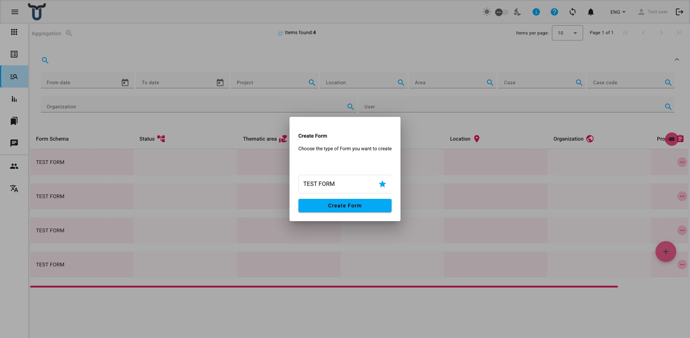

# Aggregation

The Aggregation page provides a unified view of form submissions across all form schemas. Instead of browsing one form schema at a time, you can see entries from multiple schemas together, filtered and sorted in a single list.

---

## Browsing the List

The list shows all submissions you have access to, regardless of which form schema they were created with. The following columns are displayed by default:

- **Form Schema** — the name of the form schema this submission belongs to.
- **Status** — the current workflow status of the submission.
- Additional metric columns (location, project, organisation, etc.) are shown when those metric types are active.

Click a row to select or expand it and see more details.

---

## Filtering the List

A filter bar above the list lets you narrow down which entries are shown:

- **Project** — filter by project metric.
- **Location** — filter by location metric.
- **Area** — filter by area metric.
- **Case / Case code** — filter by case or case code metric.
- **Organisation** — filter by organisation metric.
- **Status** — filter by workflow status.
- **User** — filter by the user who created the entry.

!!! note
    The Aggregation filter bar does not include presets or export options. To export data or use saved filter presets, navigate to the individual form's submissions list instead.

---

## Row Actions

Each row has a set of action icons on the right. The actions available depend on your permissions for the relevant form schema:

- **View** (eye icon) — open the entry in read-only mode.
- **Edit** (pencil icon) — open the entry for editing.
- **Print** (printer icon) — generate a PDF version of the entry. A confirmation prompt will appear before printing.
- **Delete** (bin icon) — permanently delete the entry. A confirmation prompt will appear.

!!! note "Permission-based actions"
    The actions shown for each row depend on your permissions for that specific form schema.

---

## Adding a New Entry

Click the **+ button** (floating circular button at the bottom-right of the page) to create a new submission.

A dialog will open asking you to **choose the type of form** you want to fill in:

1. Select a form schema from the list of available schemas.
2. Click **Create Form** to open the form and begin filling it in.

The list of available form schemas shown in the dialog is limited to the schemas your account has permission to create submissions for.
