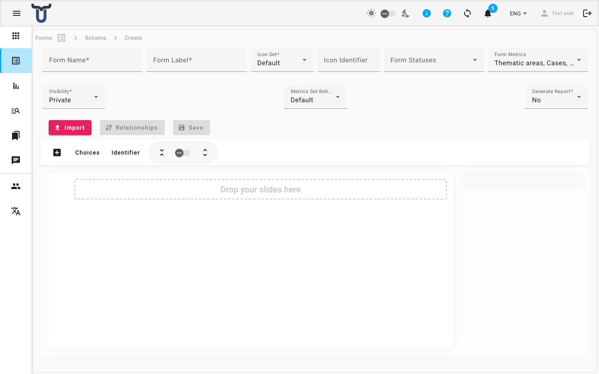

# Forms

The Forms page is your central workspace for all structured data in Dino. Here, you can access every form schema, submit new data, review past submissions, and explore your data on a map or through conversational analysis.

When you open this page, you see a list of all available form schemas. Each item shows the form's name and icon.

---

## Navigating the Page

The main page lists all form schemas you have permission to use. You can interact with this list in several ways:

1.  **Open a Form Schema**: Click on any form in the list to go to its dedicated page, where you can see all its submissions.
2.  **Search**: Use the search bar at the top to find a specific form by name.
3.  **Filter and Sort**: Use the available controls to filter the list or sort it by different columns.

!!! tip "Starting Point"
    This list is your launchpad. Each form schema represents a different type of report, survey, or data collection task for your project.

---

## Working with a Form Schema

After you click on a form schema, you are taken to its main page. From here, you can:

1.  **View Submissions**: See a table of all data previously submitted for this form.
2.  **Create a New Submission**: Click the **Create** button to open a blank form and submit new data.
3.  **Explore Data**:
    *   Go to the **Map** tab to see all submissions plotted on a map.
    *   Go to the **DataChat** tab to ask questions about your collected data using AI.

---

## Key Workflows

### To submit new data:
1.  From the main Forms page, click on the desired form schema.
2.  On the form's page, click the **Create** button.
3.  Fill out all required fields in the form that opens.
4.  Click **Submit** to save your entry.

### To review or edit existing data:
1.  From the main Forms page, click on the relevant form schema.
2.  Browse the list of submissions. Click on any individual entry to **View** its full details.
3.  If you have permission, you can click **Edit** to modify a submission.

!!! note "Managing Form Schemas"
    Creating new form schemas or editing their structure (adding/removing fields) requires administrator permissions. If you need to set up a new form type, contact your project administrator.