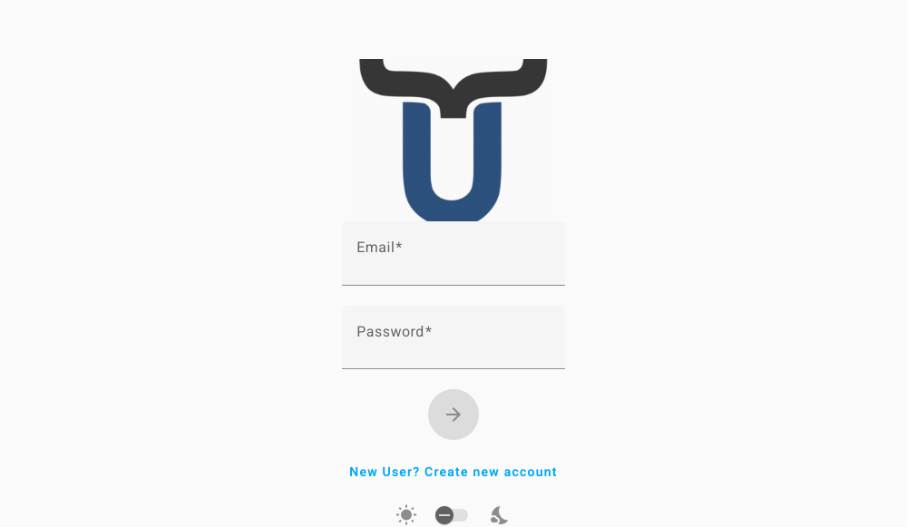

# Logging In to Dino

The Login page is the starting point of your Dino experience. From here you can sign in to your account, create a new account, or recover access if you have forgotten your password. Depending on how your organisation has set up Dino, some of the options described below may not be visible in your installation.

---

## Signing In

Use your credentials to access the platform.

1.  On the Login page, enter your **username or email address** in the first field.
2.  Enter your **password** in the second field.
3.  Click the **arrow button** to sign in.

If your credentials are correct, you will be taken to the Dashboard automatically.

If the sign-in fails, an error message will appear below the form. Double-check that your email and password are correct, making sure there are no extra spaces, and try again.

---

## Resetting Your Password

If you have forgotten your password, you can request a reset link by email.

!!! note "Optional feature"
    This option may not be available in your installation. If you do not see the "Forgot your password?" link, contact your administrator.

1.  On the Login page, click **"Forgot your password?"** below the sign-in form.
2.  Enter the **email address** associated with your account.
3.  Click the **arrow button** to send the request.

You will receive a confirmation message at the top of the screen. Check your inbox for an email containing a link to set a new password. If the email does not arrive within a few minutes, check your spam folder.

To go back to the sign-in form without resetting your password, click **"Actually, I do remember my password"**.

---

## Creating a New Account

If you do not have an account yet, you may be able to register directly from the Login page.

!!! note "Optional feature"
    This option may not be available in your installation. If you do not see the "New User? Create new account" link, contact your administrator to have an account created for you.

1.  On the Login page, click **"New User? Create new account"**.
2.  Enter your **full name**.
3.  Enter your **email address**.
4.  Choose a **password** (at least 9 characters long).
5.  Re-enter your password in the **Confirm Password** field to make sure it matches.
6.  If a **Privacy Policy** is shown, read the text and tick the checkbox to accept the terms and conditions. You must accept in order to proceed.
7.  Click the **arrow button** to create your account.

Once your account is created you will be signed in and taken to the Dashboard automatically.

If you already have an account, click **"Already have an account? Login"** to return to the sign-in form.

---

## Signing In with an External Account

Your organisation may allow you to sign in using your existing Microsoft or Google account, instead of a separate Dino password.

!!! note "Optional feature"
    This option may not be available in your installation. The buttons will only appear if your administrator has enabled external login.

1.  On the Login page, click **"Login with Microsoft"** or **"Login with Google"**, depending on which account you want to use.
2.  You will be redirected to Microsoft or Google to confirm your identity.
3.  After authorising access, you will be brought back to Dino and signed in automatically.

---

## Page Settings

A small set of display preferences are available directly on the Login page.

### Light / Dark Theme

A toggle is available at the bottom of the form, between a sun icon and a moon icon. Click or slide it to switch between **light mode** and **dark mode**. This setting takes effect immediately.

### Platform Selection

!!! note "Optional feature"
    This option may not be available in your installation. It is only shown in multi-platform deployments.

If a **"Choose your platform"** dropdown is visible, select the platform you want to connect to before signing in. The dropdown will list the environments your administrator has configured.

---

## Troubleshooting

### "There was a problem connecting to the Authentication server or your token has expired."

!!! warning
    Your previous session has expired or the connection to the authentication server was interrupted. This is not an error on your part. Simply enter your credentials and sign in again.

### "There was a problem during syncing process."

!!! warning
    An error occurred while synchronising your data, which may be related to a recent form import. Review any forms you were importing for potential issues, then sign in again. If the problem persists, contact your administrator.

### "Loading external authentication…" with no redirect

!!! warning
    This message appears briefly when completing a sign-in via Microsoft or Google. If the page does not proceed automatically after a few seconds, try signing in again. If the problem repeats, contact your administrator to check that the external authentication service is correctly configured.