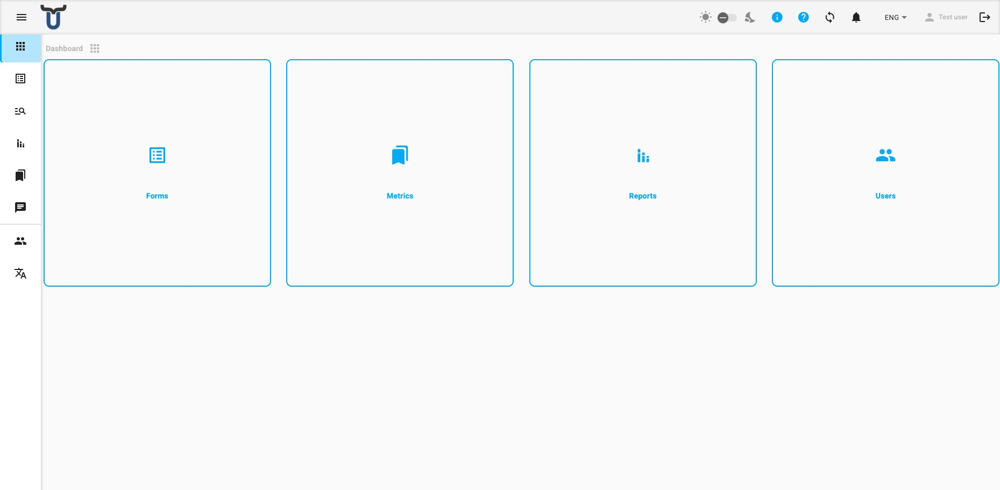
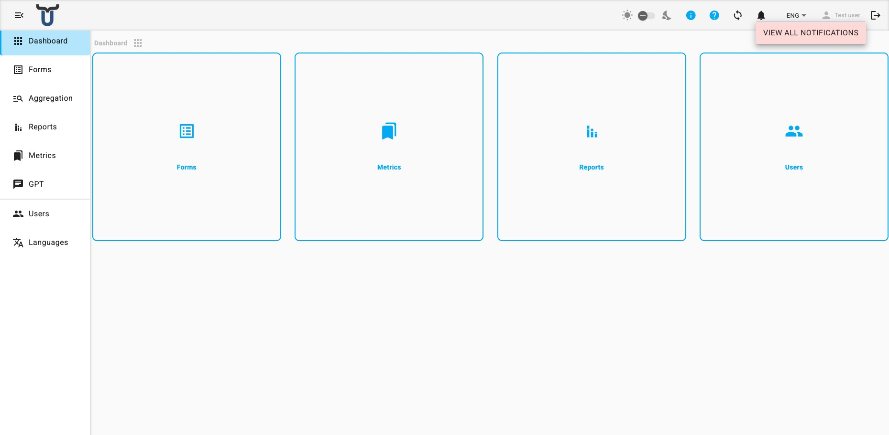
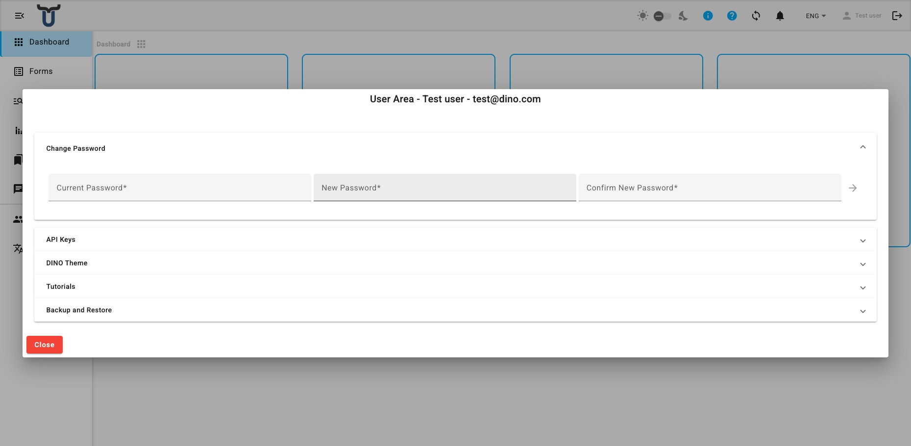
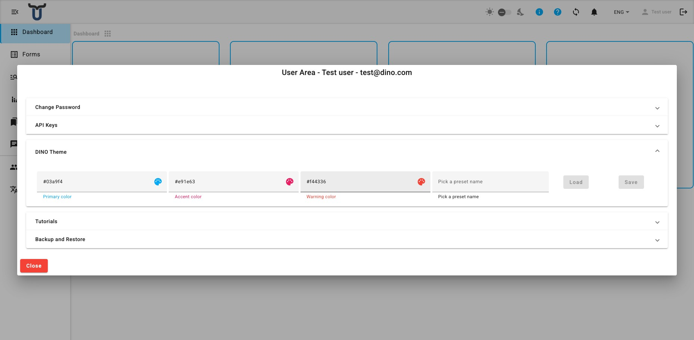

# Navigation & Interface

The Dino interface consists of a top toolbar and a side navigation menu that are present on every page after you log in.

---

## Side Navigation

The side menu lets you move between the main areas of the application.

**Standard sections** (visible to all authenticated users):

| Section | Description |
|---|---|
| Dashboard | The home screen. |
| Forms | Data collection forms and submissions. |
| Aggregation | Unified view of submissions across multiple forms. |
| Reports | Generated reports. |
| Metrics | Reference data (projects, locations, organisations, etc.). *(Hidden for guest-only users.)* |
| GPT | AI assistant (DinoGPT). |

**Admin sections** (visible to administrators only, shown below a divider):

| Section | Description |
|---|---|
| Users | User accounts and permission groups. |
| Languages | Interface translation management. |

On large screens the menu is always visible on the left. On smaller screens it collapses and can be opened with the **menu button** (hamburger icon) in the top toolbar. On either screen size, click the menu button to expand the menu labels or collapse them to icons only.

---

## Top Toolbar

The toolbar at the top of the screen contains the following controls, from left to right:

- **Menu toggle** — open or collapse the side menu.
- **Logo** — displays your organisation's logo.
- **New version indicator** — a download icon appears when a new version of Dino is available. Click it to reload the application and apply the update.
- **DINO-AI Credits** — shows your remaining AI credit balance as a badge. Click to open the [User Area](#user-area) on the Credits panel. *(Only visible if a DINO-AI API key has been configured.)*
- **Dark / Light mode toggle** — a sun icon, a slider, and a moon icon. Use the slider to switch between light and dark themes. *(Hidden on mobile — use the User Area instead.)*
- **Info icon** — hover to see version information for this installation.
- **Help icon** — opens the Dino tutorial playlist in a new tab.
- **Settings icon** — opens the [User Area](#user-area).
- **Sync icon** — shows the current data synchronisation status. Click to trigger a manual sync.
- **Notifications bell** — shows the number of unread notifications as a badge. The bell rings when new notifications arrive. See [Notifications](#notifications) below.
- **Language selector** — switch the interface language.
- **User name** — click to open the [User Area](#user-area).
- **Logout icon** — click to log out. The icon is greyed out while a sync is in progress or when the device is offline; logout is unavailable in those states.

---

## Data Synchronisation

Dino synchronises your data with the server in the background. The **sync icon** in the toolbar shows the current state:

| Icon | Meaning |
|---|---|
| `sync` (static) | All data is up to date. |
| `sync_problem` (pulsing) | You have local changes that have not been synced yet. Click to trigger a sync. |
| `sync` (spinning) | A sync is currently in progress. |
| `sync_disabled` | The device is offline; sync is not available. |
| `sync` with `!` badge | A sync problem was encountered. Check your notifications for details. |

When a sync completes, a notification appears briefly at the bottom of the screen:

- *"Synchronization complete"* — all data synced successfully.
- *"Synchronization complete with errors. Could not synchronize: [items]. Please check your notifications."* — one or more data collections could not be synced. A notification is also created in your notification list.

---

## Notifications

Click the **bell icon** in the toolbar to open the notifications dropdown. The badge on the bell shows the number of unread messages.

From the dropdown you can:

- **Click a notification** to mark it as read.
- **Click the arrow button** on a notification (if present) to navigate directly to the relevant area of the application.
- **Mark all as read** — marks all current notifications as read.
- **View all notifications** — navigates to the full [Notifications](../notifications/index.md) page.

---

## User Area

Click the **settings icon**, your **user name**, or the **DINO-AI Credits counter** to open the User Area dialog. It shows your full name and email address at the top, and contains the following sections:

### Change Password

Enter your **Current Password**, a **New Password**, and **Confirm New Password**, then click the arrow button to save. An error message will appear if the current password is incorrect or if the new passwords do not match.

### API Keys

View or set your **DINO-AI API Key**. Once a valid key is stored it is shown in read-only mode. Use the eye icon to show or hide the key, and the copy icon to copy it to the clipboard.

### Credits

Shows your current **DINO-AI credit balance**. If a payment integration is configured, an **Add more** button is available to purchase additional credits.

*(This section is only visible when a DINO-AI API key has been configured.)*

### DINO Theme

Customise the application colour scheme:

- **Primary color**, **Accent color**, **Warning color** — click the colour fields to open a colour picker.
- **Preset name** — type or select a name to save or load a colour preset.
- Click **Save** to save the current colours as a named preset, or **Load** to apply a saved preset.

On mobile, a **dark / light mode toggle** also appears here.

### Tutorials

Click **Start Dino Tour** to restart the guided tour of the application from the beginning.

*(This section is only shown if the guided tour is configured in your installation.)*

### Backup and Restore

*(Administrators only, if enabled.)*

- **Backup Data** — downloads a full export of the application database as a JSON file.
- **Restore Data** — uploads a previously exported JSON file to restore the database.
