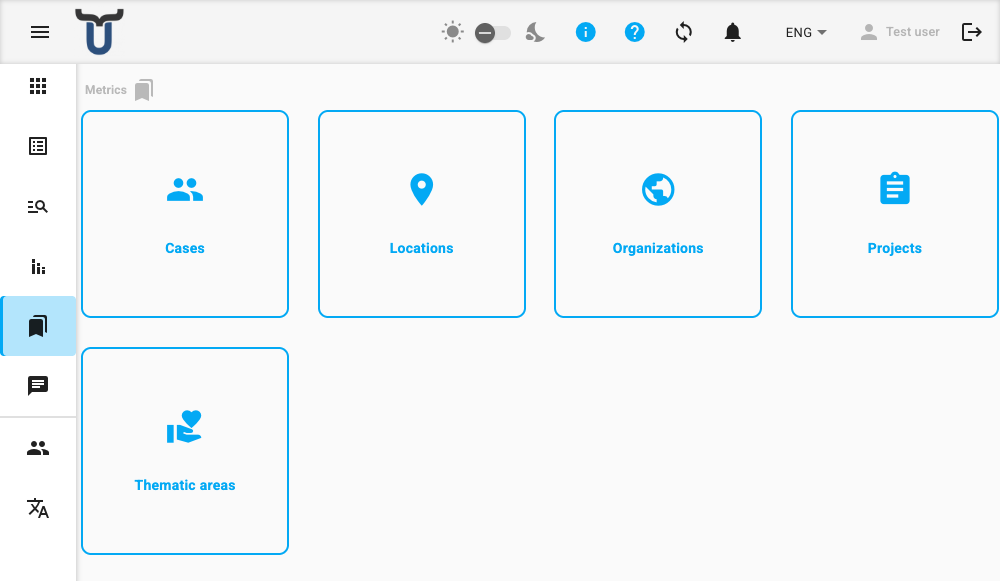

# Metrics

Metrics are the reference data categories used across Dino to classify, organize, and filter your collected data. When filling in a form or generating a report, you select values from these categories — for example, choosing a project, a location, or an organization.

The Metrics area is where you manage the lists of available values for each category. It serves as the central hub for all your reference data.

---

## Metric Types

The main page displays the metric types that are active in your Dino installation. Each type is shown as a card with an icon and label. Click on any card to open its management page.

Depending on your system configuration, some or all of the following metric types may be available:

| Metric Type | Description |
|---|---|
| **Thematic Areas** | Areas of work or thematic groupings for your activities. |
| **Cases** | Individual cases, people, or beneficiaries tracked across form submissions. |
| **Locations** | Geographic locations where data is collected or activities occur. |
| **Projects** | Projects that form submissions and reports are linked to. |
| **Organizations** | Organizations involved in or responsible for activities. |

!!! tip "Accessing Metrics"
    You can navigate to the Metrics area by clicking **Metrics** in the main application menu.

---

## What You Can Do

From the main Metrics page, you can:

1.  **View all active metric types** available for your data.
2.  **Navigate to a specific metric type** by clicking its card. This takes you to a dedicated page where you can manage the list of values for that type (e.g., add a new location or edit a project name).
3.  **Use breadcrumbs** at the top of the page to track your navigation path within the Metrics section.

For detailed instructions on adding, editing, or deleting values within a specific metric type, see [Managing Metrics](managing-metrics.md).