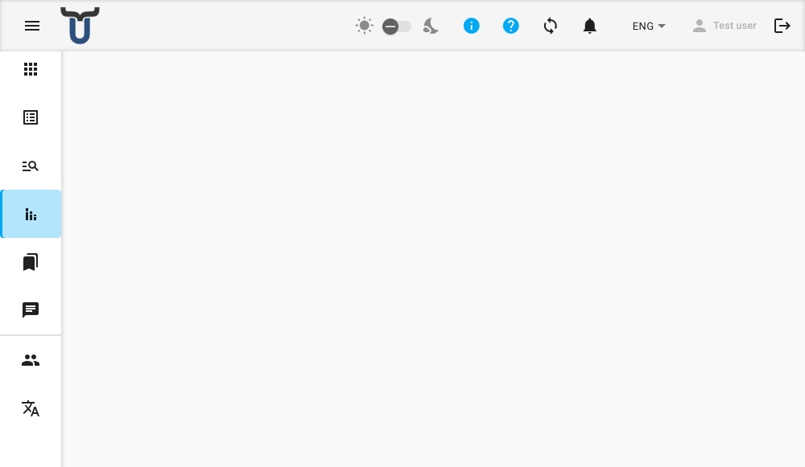

# Gestión de esquemas de informes

Los esquemas de informes definen la estructura y el diseño de los informes generados. Los administradores y los usuarios con los permisos adecuados pueden crear nuevos esquemas y editar los existentes.

!!! note "Permiso requerido"
    La gestión de esquemas de informes requiere permisos específicos. Si no puede ver las opciones de crear o editar, contacte a su administrador.

---

## Acceso a la gestión de esquemas

Desde el centro de Informes, navegue hasta el esquema que desea editar y haga clic en su acción **editar**, o utilice la navegación para llegar a la opción **Crear** para un nuevo esquema.

---

## Configuración del esquema

Complete los siguientes campos para configurar el esquema:

- **Nombre del informe** — un identificador interno único para este esquema. Aparecerá un error si el nombre ya está en uso.
- **Etiqueta del informe** — el nombre para mostrar que se muestra a los usuarios en la interfaz.
- **Conjunto de iconos** — elija entre *Predeterminado* (iconos estándar) y *Humanitario* (iconos específicos para contextos humanitarios).
- **Identificador del icono** — escriba para buscar y seleccionar el icono que representa este esquema.
- **Métricas obligatorias** — seleccione uno o más tipos de métricas (como proyecto, ubicación u organización) que deben proporcionarse al generar un informe a partir de este esquema.

---

## Esquemas de formulario asociados

Debajo de los campos de configuración, una sección de solo lectura enumera los esquemas de formulario vinculados a este esquema de informe. Estos son establecidos por el sistema y no se pueden cambiar desde esta pantalla.

---

## Vista previa del informe

Una vista previa en vivo del diseño del informe se muestra en el lado derecho de la pantalla. La vista previa se actualiza a medida que realiza cambios en la estructura del esquema.

---

## Importación de una estructura de informe

Si tiene una definición de informe existente en formato XLS, puede importarla en lugar de construir la estructura manualmente.

1. Haga clic en el botón **Importar**.
2. Seleccione su archivo XLS desde su dispositivo.
3. Revise la estructura importada en el editor.
4. Realice los ajustes necesarios y luego guarde.

---

## Guardar el esquema

Haga clic en **Guardar** para guardar el esquema. Aparecerá un mensaje de confirmación brevemente en la parte inferior de la pantalla. Después de guardar, volverá al centro de Informes.

!!! warning "¡Ups! Algo salió mal al guardar el informe"
    Si aparece un mensaje de error al guardar, verifique que los campos **Nombre del informe** y **Etiqueta del informe** estén completos y que el Nombre del informe no esté ya en uso por otro esquema. Si el problema persiste, contacte a su administrador.