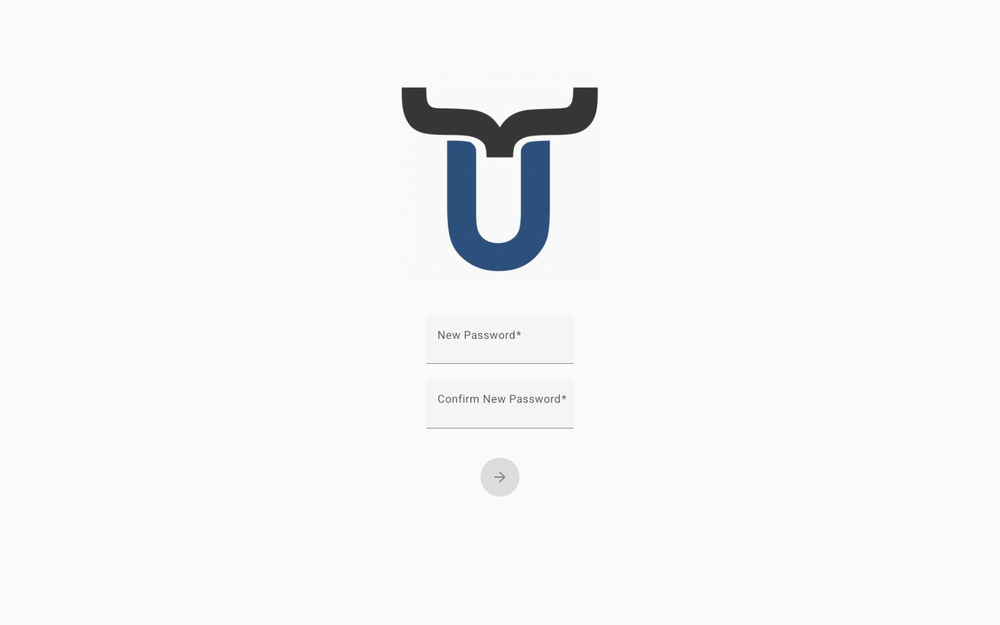

# Réinitialiser votre mot de passe

La page de réinitialisation du mot de passe vous permet de choisir un nouveau mot de passe après avoir demandé un lien de réinitialisation. Vous arrivez ici en cliquant sur le lien envoyé à votre adresse e-mail — le même lien que vous avez demandé via l'option **"Mot de passe oublié ?"** sur la page de connexion.

!!! note
    Si vous n'avez pas encore demandé de lien de réinitialisation, rendez-vous d'abord sur la [page de connexion](login.md) et cliquez sur **"Mot de passe oublié ?"**.

---

## Définir un nouveau mot de passe

1.  Ouvrez le lien de réinitialisation depuis votre e-mail. Cela vous amènera directement sur la page de réinitialisation du mot de passe.
2.  Saisissez votre **nouveau mot de passe** dans le premier champ. Votre mot de passe doit comporter au moins 9 caractères.
3.  Resaisissez le même mot de passe dans le champ **Confirmer le nouveau mot de passe** pour vérifier qu'il correspond.
4.  Cliquez sur le **bouton fléché** pour confirmer votre nouveau mot de passe.

Si le mot de passe est accepté, un message de confirmation apparaîtra en haut de l'écran et vous serez automatiquement redirigé vers la page de connexion après quelques secondes. Vous pourrez alors vous connecter avec votre nouveau mot de passe.

---

## Dépannage

### "Votre ticket de réinitialisation de mot de passe est invalide ou a expiré. Veuillez réessayer."

!!! warning
    Le lien que vous avez utilisé n'est plus valide. Les liens de réinitialisation expirent après un court délai pour des raisons de sécurité. Retournez sur la [page de connexion](login.md), cliquez à nouveau sur **"Mot de passe oublié ?"** et demandez un nouveau lien.

### "Mot de passe incorrect"

!!! warning
    Le mot de passe n'a pas pu être enregistré. Assurez-vous que les deux champs contiennent exactement le même mot de passe et qu'il comporte au moins 9 caractères, puis réessayez. Si le problème persiste, demandez un nouveau lien de réinitialisation depuis la page de connexion.

### La page ne redirige pas après une réinitialisation réussie

!!! tip
    Si le message de confirmation apparaît mais que la page ne redirige pas automatiquement vers la page de connexion, naviguez-y manuellement. Votre mot de passe a déjà été modifié avec succès.