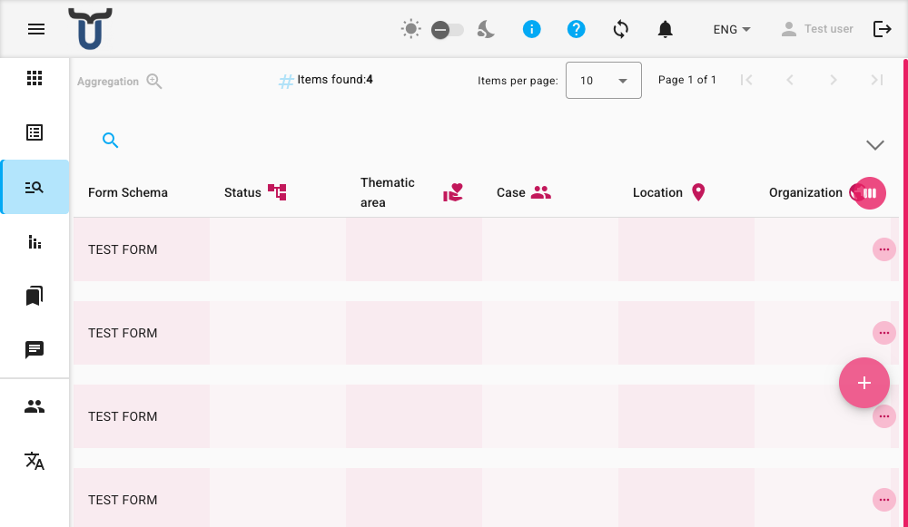

# Aggregazione

La pagina Aggregazione fornisce una vista unificata di tutte le compilazioni dei moduli all'interno della tua organizzazione. Invece di visualizzare le compilazioni per uno schema di modulo alla volta, puoi vedere le voci provenienti da più schemi insieme in un unico elenco filtrato.

## Sfogliare l'Elenco

L'elenco mostra tutte le compilazioni che hai il permesso di visualizzare. Ogni riga rappresenta una singola compilazione. Per impostazione predefinita vengono mostrate le seguenti colonne:

*   **Schema Modulo**: Il nome dello schema di modulo a cui appartiene questa compilazione.
*   **Stato**: Lo stato attuale del flusso di lavoro della compilazione.
*   Possono apparire anche colonne aggiuntive per metriche come **Progetto**, **Località** o **Organizzazione**, a seconda della configurazione del tuo sistema.

Puoi fare clic su qualsiasi riga per selezionarla o espanderla per vedere maggiori dettagli.

## Filtrare l'Elenco

Una barra dei filtri si trova sopra l'elenco. Usala per restringere le compilazioni mostrate. Puoi filtrare per:

*   Progetto
*   Località
*   Area
*   Caso
*   Codice Caso
*   Organizzazione
*   Stato del Modulo
*   Utente

!!! tip "Suggerimenti per il Filtro"
    La barra dei filtri di Aggregazione è progettata per un filtraggio rapido tra schemi. Per funzionalità avanzate come preset di filtri salvati o esportazione dei dati, naviga verso l'elenco delle compilazioni per uno specifico schema di modulo.

## Azioni sulla Riga

Quando passi il mouse sopra una riga, sulla destra appare una serie di icone di azione. Le azioni disponibili per una specifica compilazione dipendono dai tuoi permessi per il suo schema di modulo.

*   **Visualizza** (): Apri la compilazione in una vista di sola lettura.
*   **Modifica** (): Apri la compilazione per la modifica.
*   **Stampa** (): Genera e apri una versione PDF della compilazione. Ti verrà chiesto di confermare prima che il PDF venga creato.
*   **Elimina** (): Elimina definitivamente la compilazione. Ti verrà chiesto di confermare questa azione.

## Creare una Nuova Compilazione

Puoi avviare una nuova compilazione di modulo direttamente dalla pagina Aggregazione.

1.  Fai clic sul pulsante **+** (Aggiungi) nell'angolo in basso a destra dello schermo.
2.  Si apre una finestra di dialogo, che mostra un elenco degli schemi di modulo per i quali hai il permesso di creare compilazioni.
3.  Seleziona lo schema di modulo desiderato dall'elenco.
4.  Fai clic su **Crea Modulo**. Verrai portato al modulo per iniziare a compilarlo.