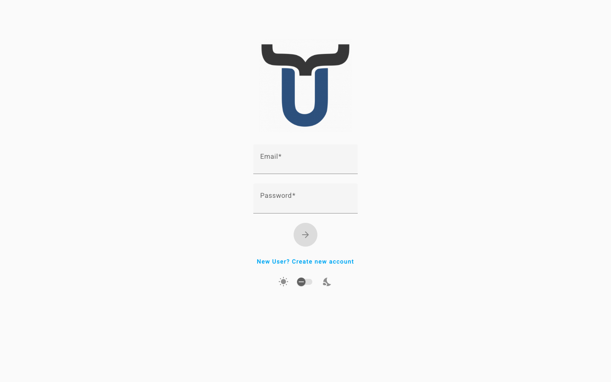

# Accesso a Dino

La pagina di accesso è il punto di partenza della tua esperienza con Dino. Da qui puoi accedere al tuo account, crearne uno nuovo o recuperare l'accesso se hai dimenticato la password. A seconda di come la tua organizzazione ha configurato Dino, alcune delle opzioni descritte di seguito potrebbero non essere visibili nella tua installazione.

---

## Accedere

Utilizza le tue credenziali per accedere alla piattaforma.

1.  Nella pagina di accesso, inserisci il tuo **nome utente o indirizzo email** nel primo campo.
2.  Inserisci la tua **password** nel secondo campo.
3.  Fai clic sul **pulsante con la freccia** per accedere.

Se le tue credenziali sono corrette, verrai reindirizzato automaticamente alla Dashboard.

Se l'accesso non riesce, apparirà un messaggio di errore sotto il modulo. Controlla attentamente che l'email e la password siano corrette, assicurandoti che non ci siano spazi extra, e riprova.

---

## Reimpostare la password

Se hai dimenticato la password, puoi richiedere un link di reimpostazione via email.

!!! note "Funzionalità opzionale"
    Questa opzione potrebbe non essere disponibile nella tua installazione. Se non vedi il link "Password dimenticata?", contatta il tuo amministratore.

1.  Nella pagina di accesso, fai clic su **"Password dimenticata?"** sotto il modulo di accesso.
2.  Inserisci l'**indirizzo email** associato al tuo account.
3.  Fai clic sul **pulsante con la freccia** per inviare la richiesta.

Riceverai un messaggio di conferma nella parte superiore dello schermo. Controlla la tua casella di posta per un'email contenente un link per impostare una nuova password. Se l'email non arriva entro pochi minuti, controlla la cartella dello spam.

Per tornare al modulo di accesso senza reimpostare la password, fai clic su **"In realtà, ricordo la mia password"**.

---

## Creare un nuovo account

Se non hai ancora un account, potresti essere in grado di registrarti direttamente dalla pagina di accesso.

!!! note "Funzionalità opzionale"
    Questa opzione potrebbe non essere disponibile nella tua installazione. Se non vedi il link "Nuovo utente? Crea un nuovo account", contatta il tuo amministratore per farti creare un account.

1.  Nella pagina di accesso, fai clic su **"Nuovo utente? Crea un nuovo account"**.
2.  Inserisci il tuo **nome completo**.
3.  Inserisci il tuo **indirizzo email**.
4.  Scegli una **password** (lunga almeno 9 caratteri).
5.  Reinserisci la password nel campo **Conferma password** per assicurarti che corrisponda.
6.  Se viene mostrata un'**Informativa sulla privacy**, leggi il testo e spunta la casella per accettare i termini e le condizioni. Devi accettare per procedere.
7.  Fai clic sul **pulsante con la freccia** per creare il tuo account.

Una volta creato l'account, accederai automaticamente e verrai reindirizzato alla Dashboard.

Se hai già un account, fai clic su **"Hai già un account? Accedi"** per tornare al modulo di accesso.

---

## Accedere con un account esterno

La tua organizzazione potrebbe consentirti di accedere utilizzando il tuo account Microsoft o Google esistente, invece di una password Dino separata.

!!! note "Funzionalità opzionale"
    Questa opzione potrebbe non essere disponibile nella tua installazione. I pulsanti appariranno solo se il tuo amministratore ha abilitato l'accesso esterno.

1.  Nella pagina di accesso, fai clic su **"Accedi con Microsoft"** o **"Accedi con Google"**, a seconda dell'account che desideri utilizzare.
2.  Verrai reindirizzato a Microsoft o Google per confermare la tua identità.
3.  Dopo aver autorizzato l'accesso, verrai riportato su Dino e accederai automaticamente.

---

## Impostazioni della pagina

Un piccolo insieme di preferenze di visualizzazione è disponibile direttamente nella pagina di accesso.

### Tema Chiaro / Scuro

Un interruttore è disponibile nella parte inferiore del modulo, tra un'icona di sole e un'icona di luna. Clicca o trascinalo per passare dalla **modalità chiara** alla **modalità scura**. Questa impostazione ha effetto immediato.

### Selezione della piattaforma

!!! note "Funzionalità opzionale"
    Questa opzione potrebbe non essere disponibile nella tua installazione. Viene mostrata solo nelle distribuzioni multi-piattaforma.

Se è visibile un menu a discesa **"Scegli la tua piattaforma"**, seleziona la piattaforma a cui desideri connetterti prima di accedere. Il menu a discesa elencherà gli ambienti configurati dal tuo amministratore.

---

## Risoluzione dei problemi

### "Si è verificato un problema durante la connessione al server di autenticazione o il tuo token è scaduto."

!!! warning
    La tua sessione precedente è scaduta o la connessione al server di autenticazione è stata interrotta. Questo non è un errore da parte tua. Inserisci semplicemente le tue credenziali e accedi di nuovo.

### "Si è verificato un problema durante il processo di sincronizzazione."

!!! warning
    Si è verificato un errore durante la sincronizzazione dei tuoi dati, che potrebbe essere correlato a un recente import di moduli. Rivedi eventuali moduli che stavi importando per potenziali problemi, quindi accedi di nuovo. Se il problema persiste, contatta il tuo amministratore.

### "Caricamento autenticazione esterna…" senza reindirizzamento

!!! warning
    Questo messaggio appare brevemente quando si completa un accesso tramite Microsoft o Google. Se la pagina non procede automaticamente dopo alcuni secondi, prova ad accedere di nuovo. Se il problema si ripete, contatta il tuo amministratore per verificare che il servizio di autenticazione esterna sia configurato correttamente.