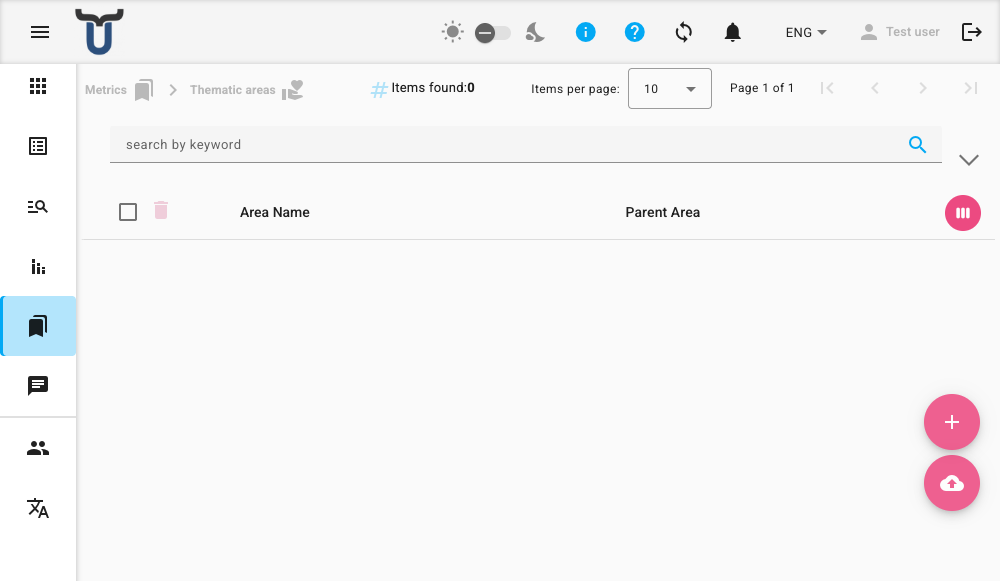

# Керування метриками

У Dino ви можете керувати різними типами структурованих даних, які називаються метриками. До них належать Тематичні області, Справи, Локації, Проекти та Організації. Доступ до кожного типу здійснюється з головної навігації. Кожен тип метрики має власну сторінку керування зі сталою структурою для перегляду та управління його записами.

!!! note "Потрібні дозволи"
    Для керування значеннями метрик потрібні спеціальні дозволи. Якщо ви не бачите опцій створення, редагування чи видалення, зверніться до свого адміністратора.

---

## Перегляд списку

На головній сторінці відображається список усіх записів для вибраного типу метрики. Ви можете:

*   **Шукати та фільтрувати**: Використовуйте рядок пошуку над списком, щоб знайти записи за назвою чи іншими атрибутами.
*   **Сортувати**: Натискайте на заголовки стовпців, позначені значком сортування, щоб змінити порядок списку.
*   **Експортувати**: Натисніть кнопку **Експорт** на панелі інструментів, щоб завантажити поточний список у вигляді файлу.
*   **Вибрати або розгорнути**: Натисніть будь-де на рядку, щоб вибрати його. Натисніть значок розгортання, щоб побачити більше деталей.

---

## Створення нового запису

1.  Натисніть кнопку **+** (круглу плаваючу кнопку внизу праворуч на екрані).
2.  Відкриється діалогове вікно з полями для нового запису.
3.  Заповніть обов'язкову інформацію та натисніть **Зберегти**.

---

## Редагування або перегляд запису

Кожен рядок у списку має значки дій з правого боку.

1.  Щоб переглянути деталі запису без редагування, натисніть значок **Перегляд (око)**.
2.  Щоб редагувати запис, натисніть значок **Редагувати (олівець)**.
3.  Відкриється те саме діалогове вікно редактора, заповнене поточними даними запису. Внесіть зміни та натисніть **Зберегти**.

---

## Видалення записів

Ви можете видаляти записи по одному або масово.

**Щоб видалити один запис:**
1.  Натисніть значок **Видалити (відро для сміття)** на рядку, який потрібно видалити.
2.  З'явиться діалогове вікно підтвердження. Натисніть **Підтвердити**, щоб остаточно видалити запис.

**Щоб видалити кілька записів:**
1.  Виберіть записи, поставивши прапорці у відповідних рядках.
2.  З'явиться панель інструментів. Натисніть дію **Видалити** на цій панелі.
3.  Підтвердіть видалення у вікні, що з'явиться.

---

## Масовий імпорт записів

Ви можете додати багато записів одночасно, імпортувавши їх з файлу.

1.  Натисніть кнопку **Імпорт (завантаження з хмари)**, яка є плаваючою кнопкою внизу праворуч на екрані.
2.  У діалоговому вікні натисніть **Вибрати файл** та оберіть файл `.xls`, `.xlsx` або `.csv` зі свого пристрою.
3.  (Необов'язково) Поставте прапорець **Не імпортувати метрики, якщо назва вже існує**, щоб уникнути створення дублікатів записів.
4.  Натисніть **Застосувати**, щоб розпочати імпорт.
5.  Натисніть **Закрити**, коли процес завершиться.

---

## Розуміння редактора записів

Коли ви створюєте, редагуєте або переглядаєте запис, відкривається діалогове вікно з його полями. Доступні поля залежать від типу метрики.

### Загальні поля
*   **Назва** *(Обов'язкове)*: Відображувана назва цього запису. Вона має бути унікальною в межах свого типу метрики.
*   **Батьківський елемент**: Необов'язкове поле для зв'язку цього запису з батьківським, створюючи ієрархію (наприклад, підпроект у межах проекту). Почніть вводити текст, щоб знайти та вибрати батьківський елемент.

### Поля, специфічні для метрики

| Тип метрики | Ключові поля (окрім назви та батьківського елемента) |
| :--- | :--- |
| **Тематичні області** | Додаткових стандартних полів немає. |
| **Справи** | **Код** (лише для читання), **Зображення** (завантажити або зробити фото). |
| **Локації** | **Координати**. |
| **Організації** | **Шлях до логотипу**, **URL веб-сайту**. |
| **Проекти** | **Код**, **Сектори втручання**, **Донори**, **Дата початку**, **Дата завершення**. |

### Додаткові атрибути

Під стандартними полями ви знайдете розділ **Додаткові атрибути**. Тут ви можете додати до запису власні пари ключ-значення.
*   Натисніть **+**, щоб додати новий рядок атрибута.
*   Натисніть **-** поруч із атрибутом, щоб видалити його.
*   Цей розділ прихований у режимі перегляду, якщо користувацьких атрибутів немає.

### Збереження роботи
Натисніть **Зберегти**, щоб створити або оновити запис. З'явиться коротке повідомлення про підтвердження.

!!! warning "Помилки збереження"
    Якщо під час збереження ви бачите помилку, перевірте, чи заповнені всі обов'язкові поля та чи назва запису ще не використовується. Якщо проблема продовжується, зверніться до свого адміністратора.

!!! warning "Офлайн завантаження зображень"
    Якщо ви збережете запис із зображенням у режимі офлайн, зображення не буде завантажено. Вам потрібно буде повторно зберегти запис, коли ви знову будете в мережі, щоб завантажити файл зображення.